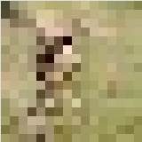
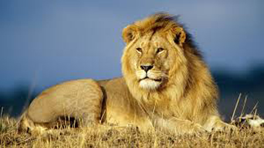
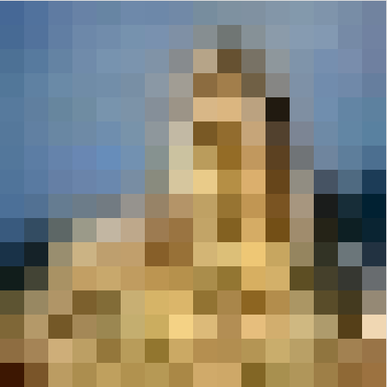
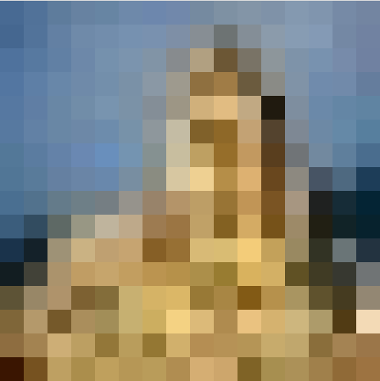

# Technical Challenge
## SARAO Data Science Technical Challenge

_In this technical challenge we want to test for basic skills such as python coding, ability to handle data and reuse open-source code etc., but also to explore more intangible skills such as flexibility, creativity, independence, communication, ability to relearn and teach yourself, ability to implement ideas, ability to solve challenging problems and to scale them to handle large volumes of data._

## QUESTIONS

### Exact image repetition

__For the first question your goal is to write a python function to determine whether a test image is identical to any image in the Training directory of images. In addition to working code please outline your algorithm and briefly discuss its potential limitations and how you might speed it up.__

 One could directly compare the byte values of each image file in the Testing directory to the target image, and print the boolean response to the command line. One could also convert the image files to an array (numpy) in memory and perform pixel-by-pixel comparison.
 
 When invoked with arguments pointing to the test image and database directory respectively, the python script compareTwoImagesExact.py will return if any of the database images is an exact binary match to the test image, and also if the numpy representations of the two images exactly match.

Of course there are serious limitations to this approach:
* for the binary comparison to succeed, the files must be precisely the same; one is unable with this approach to determine similarity of images if they are of different file formats, even the same class of file format, even if the images are otherwise identical in all respects.
* the numpy representation (`bit map' comparison) is marginally better, in that it could be possible to correctly identify copies from two different image files if their ipython representations are the same.
    
* any image modification, such as rotations, translations, blurring, the addition of noise, scaling, and cropping will result in failure of direct comparison.
* this method is not optimised for speed in any way. For faster execution, especially of for loops, one could for example port the script to Cython. In the second question, I implement a method for computing scaled, uniform 16x16 pixel 'postage-stamp' representations of the image maps that can be precomputed and stored in a database, affording speedier comparison of multiple images

### Image repetition with resizing

__We next want to check if a new test image is the same as any of the training data, but this time allowing for possible resizing of the test image (you may assume the aspect ratio of the two images is the same if they have been resized). Write a python function to solve this problem and briefly describe your solution.__

In order to compare two scaled versions of an identical image, we scale both to a common grid of an appropriate dimension and directly compare the scaled representations.

Grid size: there are various options for the grid size: one could decide to use the size of the smaller image as the reference size, or preferably* determine some global grid size to which all images are scaled for comparison.

_*(the global grid approach is preferable because it will afford the ability to pre-compute and store a database of 'thumbnail' images. It will have a predictable/bounded computation time, and also more predictable results between arbitrary input images)_

Nearness: aliasing effects due to resizing are likely to change the pixel values slightly for identical, scaled images, so ideally a nearness function and appropriate threshold should be determined, rather than exact pixel comparison.

Require: 
+ robust scaling method that returns an in-memory array of fixed gridsize
+ nearness function that returns a value that represents the global pixel nearness of two fixed-size images

Issues: 
+ while this approach can deal with scaling, other image modifications (rotations, translations, blurring, the addition of noise, scaling, cropping) are not dealt with.

One issue is that a bitwise comparison of the np arrays when a sample image ("/Test/test_image9.jpg", shown below) is scaled and rescaled and compared to the original version of itself yields a dismal similarity in a bitwise comparison (i.e. 59.8% of bit-wise pixel values are different), even though the images appear identical to the naked eye:

    In [58]: np.count_nonzero(im1!=im2_scaled)/im1.size
    Out[58]: 0.5979717813051146
    
 

    
Converting these images to greyscale helps slightly:

    In [89]: grey1=cv2.cvtColor(im1, cv2.COLOR_BGR2GRAY)
    In [90]: grey2=cv2.cvtColor(im2_scaled, cv2.COLOR_BGR2GRAY)
    In [91]: np.count_nonzero(grey1!=grey2)/grey1.size
    Out[91]: 0.5714285714285714

Quantising the pixel values to 2^4 bits rather than than 2^8 helps more:
    
    np.count_nonzero(im1_quant!=im2_quant)/im1_quant.size
    Out[112]: 0.15625220458553793
   
Using (16x16) thumbnail versions of the images helps too:

    In [62]: np.count_nonzero(thumb1!=thumb2)/thumb1.size
    Out[62]: 0.4127604166666667
    
 

    
Note that all quantisation processes (RBG colour, pixel values, and image size) make the algorithm more likely to match images with slight modifications in rotation and translation, as well as higher-order modifications, at the cost of not being as well able to differentiate similar but not identical images. It makes sense to tune these parameters (with the help of a Training database) to maximise the False-positive/false-negative rate.

In the full implementation, I have written a comparison function that allows all three options, but with defaults set to keep colour information, quantise pixel values more coarsely (by/to2^4), and to use thumbnail representations.

    python3 scaledImageRepetition.py ../Data_Science_Images/Test/test_image6.jpeg ../Data_Science_Images/Test/

## Perceptual Hashing
All of the above processes are, in effect, tending toward a hash function (i.e. a map of arbitrary-sized data to data of fixed size) of the input image. Specifically, we would like a _perceptual_ hash of the image, one that produces similar hashes for similar input vectors/maps and dissimilar hashes for dissimilar inputs (note that this is the opposite behaviour requiured of cryptographic hash functions, which require maximally uncorrelated hashes for nearby input values).

A major advantage of this method is that hashing is computationally efficient, and broadly corresponds to our requirements. The main issues with the class of perceptual hashes in general is that they are not generally rotation-invariant and do not work as well if the image is cropped, damaged or amended (although, as expected, there are variants that combat this at the cost of performance in other metrics).

But of course there are multiple variants and each performs differently to each kind of image modification. The [OpenCV img_hash](https://docs.opencv.org/3.3.1/d4/d93/group__img__hash.html "OpenCV img_hash") class implements various perceptual hashes. Shown below is the performance against various image modifications:

![alt hash function comparison][logo]

[logo]: https://docs.opencv.org/3.3.1/attack_performance.JPG

For good performance against a wide range of attacks/modifications, one would possibly implement more than one hash of each image and combine the results. Not shown, nor implemented in the above module is a simple difference hash, which performs exceptionally well under a wide range of attacks (see, e.g. [this](http://www.hackerfactor.com/blog/index.php?/archives/529-Kind-of-Like-That.html) analysis of difference hashing performance). 

### Image repetition with blurring or added noise

1. _A friend of yours decides to try to fool your system by messing with the test images before you receive them. She does this by Gaussian blurring some of the images or by adding a small amount of noise to each pixel in the image. Design a simple machine learning algorithm that can handle such types of image distortions of the images, as well the cases already discussed in questions 1 and 2._

2. _Write python code to solve this for an arbitrary input test image. Discuss your solution in detail and why you chose it. Also discuss other potential approaches to the problem and their pros and cons._

We require, for this challenge comparison, a map of the input image to some hash or representation in some basis that is:
+ broadly insensitive to rotations and translations, affine-invariance.
+ insensitive (with respect to the difference in SNR between images) to blurred or noisy images, and
+ also has some ability to deal with cropping (a harder problem)
+ efficient/fast execution speed is also desirable.

A solution (that will take more computation and time) is to use some kind of feature selection and extraction algorithm that has required properties. Examples of these are SSIM, SIFT/SURF, or else some weighted combination of these that has, say been trained to optimal weights using machine learning practices. 

These algorithms essentially operate on chunks of maps at multiple scales, identifying features that are peaks at multiple chunk scales. Once these are identified, they are described in a way forcing them to the same size and orientation for lookup. Since for different images these features should presumably be scattered throughout the image, the image can be recognized even if certain features are obscured or modified. It's certainly not as straight-forward as a DCT metric on a downsampled image, but the nature of widespread image capture, creation and manipulation usually requires this robustness.

One could also take some set of combined image representations and determine weighting of each in the final distinguisher function by standard machine learning techniques (training/backprop).

If I had lots of time, I'd perhaps test one of these hybrid methods. Since I don't, I have chosen to use the dhash algorithm, installed through PyPI (which itself depends on PIL)

## implement algorithm

The python script perceptualHashRecognition.py run with arguments of the test image and database directory respectively, implements a difference hash on both images, and compares each through the Hamming distance metric:

    python3 perceptualHashRepetition.py Data_Science_Images/Test/test_image6.jpeg Data_Science_Images/Test/
    
    Matching image found in database directory:  test_image8.jpg  (score:  1.0 ).
    Matching image found in database directory:  test_image9.jpg  (score:  0.9921875 ).
    Matching image found in database directory:  test_image6.jpeg  (score:  1.0 ).
    
## handling false-positive/false-negative ratio
_Suppose you want a False Positive to False Negative rate of 2-1 (i.e., for every image that you incorrectly exclude from your database, you are willing to accept two images that should have been excluded because they are replicas of images in your database). How would you go about achieving that ratio, assuming you had a sufficiently large training set of images?_

## Adding Metadata
You notice that each training image in your database, and every new test image, also comes with a metadata tag telling you where it came from.
Let’s call this tag X. After some calculation you find that certain tags are more likely to correspond to images already in your dataset than others. Using appropriate pseudo-code or equivalently clear writing that would allow someone to begin coding your algorithm, describe how you would systematically use this metadata information to reduce your false positive and false negative error rate in discarding images?

## Scaling to Large Datasets
How would the algorithms and ideas you presented in questions 3 and 4 scale to a large number of test and training images with unknown noise/blurring in each image? Please comment on the computational efficiency of your algorithms? What could be done to possibly make them more efficient? (Imagine you were doing this for the Google Image database!)

## Closing Question
• Do you think this set of challenges missed some important data science skills that you have? If so please let us know. This is a chance to let us know what your super skills are!
